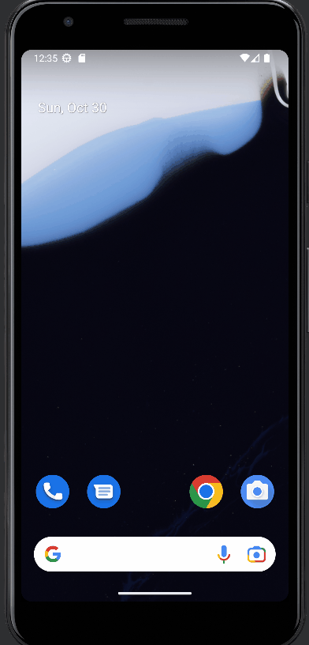

# Milestone 1 - Jot It Down

## Table of Contents

1. Overview
2. Product Spec
3. Wireframes
4. Figma
## Overview

### Description

The note taking app will allow users to take notes. They will also be able to customize the theme, change the font, create and delete notes.

### App Evaluation

Evaluation of your app across the following attributes
- **Category:** Lifestyle
- **Mobile:** Making this app mobile will facilitate easy access to notes being that most people always have their notes
- **Story:** We live in an information driven world so the need for note taking is a necessity, whether that is taking notes in class, at church or simply writing down someone's email, note taking is essential.
- **Market:** Anyone who is driven by information and is wants to transition to a mobile way of taking notes
- **Habit:** How often a user uses this app is user dependent, some users may use it for only classes or just to write down random names and contact information of the people they may meet.
- **Scope:** This project can be done in the time span allotted.

## Product Spec

### 1. User Features (Required and Optional)

**Required Features**

* Ability to change themes
* Ability to change fonts
* Ability to create/delete notes

**Stretch Features**

* Ability to collaborate with others in real time

### 2. Screen Archetypes

- My Notes
    - User can access previously written notes and edit notes or delete notes
    - User can change the notes display image
- New Note
    - User can create new note, change fonts, change note theme, highlights, etc
    - User can upload images to note, insert tables, lists, etc

### 3. Navigation

**Tab Navigation** (Tab to Screen)

* My Notes
* New Notes

**Flow Navigation** (Screen to Screen)

- My Notes Tab
    - My Notes Screen
- Notes on My Notes Screen
    - Long Press to Delete
    - Short tap to go to that specific notes
- Search
    - None
- New Notes
    - Blank Note Section

## Wireframes

Add picture of your hand sketched wireframes in this section

### [BONUS] Digital Wireframes & Mockups

https://www.figma.com/file/8nOc20QkOwJNA9U6uXXbUW/Untitled?node-id=0%3A1

## Project Board
https://github.com/orgs/Jot-It-Down/projects/1

# Milestone 2:
- [x] XML for each note card in recycler view

# Milestone 3:

- [x] Load notes on app open
- [x] DAO for Room Database to query all notes, specific note and delete notes
- [x] Long Press to delete note
- [x] Room Database for notes(name, content, date_created)

# Milestone 4:
- [x] Create Navigation Graph
- [x] Create bottom navigation menu

# Milestone 5:
- [ ] Ability to choose font
- [ ] Ability to change theme

# Milestone 6:
- [ ] Create Recycler View Fragment for veiwing previously create notes
- [ ] Create Fragment for creating new note

# Milestone 7:
- [ ] Toast notification when note is saved
- [ ] Tap to open to specific notes
